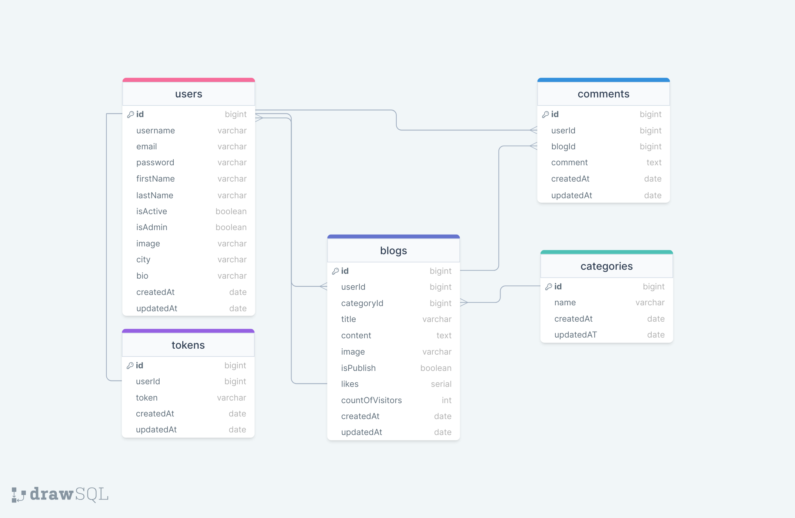

# Blog App API

This project is a RESTful API developed using Node.js and Express. The API interacts with a MongoDB database and is documented with Swagger.

## ERD



## Table of Contents

- [Technologies Used](#technologies-used)
- [Documentation](#documentation)
- [Endpoints](#endpoints)
- [Project Skeleton](#project-skeleton)

## Live Demo

[Blog App API](https://blog-app-api-iota.vercel.app/)

## Technologies Used

- **Node.js**: A JavaScript runtime built on Chrome's V8 JavaScript engine.
- **Express**: A minimal and flexible Node.js web application framework that provides a robust set of features for web and mobile applications.
- **Mongoose**: An ODM (Object Data Modeling) library for MongoDB and Node.js, providing a straight-forward, schema-based solution to model your application data.
- **dotenv**: A zero-dependency module that loads environment variables from a `.env` file into `process.env`.
- **cors**: A node.js package for providing a Connect/Express middleware that can be used to enable CORS (Cross-Origin Resource Sharing) with various options.
- **express-async-errors**: A small utility to handle errors in async/await routes in Express.
- **redoc-express**: A middleware for hosting OpenAPI (Swagger) documentation using ReDoc.
- **request-ip**: A simple way to retrieve a user's IP address in a Node.js application.
- **swagger-autogen**: A tool to automatically generate Swagger/OpenAPI documentation from existing code.
- **swagger-ui-express**: A middleware for serving the Swagger UI bound to your Swagger/OpenAPI specification.
- **validator**: A library for string validation and sanitization.

## Documentation

- Swagger UI: [https://blog-app-api-iota.vercel.app/documents/swagger](https://blog-app-api-iota.vercel.app/documents/swagger)
- Redoc: [https://blog-app-api-iota.vercel.app/documents/redoc](https://blog-app-api-iota.vercel.app/documents/redoc)
- JSON Documentation: [https://blog-app-api-iota.vercel.app/documents/json](https://blog-app-api-iota.vercel.app/documents/json)

## Endpoints

### Users

- `GET /users`: Lists all users.
- `POST /users`: Creates a new user.
- `GET /users/:userId`: Displays a specific user.
- `PUT /users/:userId`: Updates information of a specific user.
- `DELETE /users/:userId`: Deletes a specific user.

### Authentication
- `POST /auth/login`: Provides user login.
- `GET /auth/logout`: Terminates the user session.

### Blogs

- `GET /blogs`: Lists all blogs.
- `POST /blogs`: Creates a new blog.
- `GET /blogs/:blogId`: Displays a specific blog.
- `PUT /blogs/:blogId`: Updates information of a specific blog.
- `DELETE /blogs/:blogId`: Deletes a specific blog.

### Categories

- `GET /categories`: Lists all blog categories.
- `POST /categories`: Creates a new blog category.
- `GET /categories/:categoryId`: Displays a specific blog category.
- `PUT /categories/:categoryId`: Updates information of a specific blog category.
- `DELETE /categories/:categoryId`: Deletes a specific blog category.

### Comments

- `GET /comments`: Lists all comments.
- `POST /comments`: Creates a new comment.
- `GET /comments/:commentId`: Displays a specific comment.
- `PUT /comments/:commentId`: Updates information of a specific comment.
- `DELETE /comments/:commentId`: Deletes a specific comment.

## Project Skeleton

```
Blog App API (folder) 
│
├── src
│    ├── configs
│    │     ├── dbConnection.js
│    │     └── swagger.json
│    ├── controllers
│    │     ├── auth.js     
│    │     ├── blog.js          
│    │     ├── category.js          
│    │     ├── comment.js          
│    │     ├── product.js     
│    │     ├── token.js     
│    │     └── user.js
│    ├── helpers
│    │     ├── passwordEncrypt.js    
│    │     └── sync.js 
│    ├── middlewares 
│    │     ├── authentication.js 
│    │     ├── errorHandler.js 
│    │     ├── permissions.js   
│    │     ├── queryHandler.js   
│    │     └── requestIp.js 
│    ├── models                        
│    │     ├── blog.js          
│    │     ├── category.js          
│    │     ├── comment.js              
│    │     ├── token.js     
│    │     └── user.js
│    └── routes                
│          ├── auth.js     
│          ├── blog.js     
│          ├── category.js     
│          ├── comment.js     
│          ├── document.js     
│          ├── index.js         
│          ├── token.js     
│          └── user.js
├── .gitignore
├── index.js
├── package-lock.json
├── package.json
├── swaggerAutogen.js
├── vercel.json
└── README.md
```